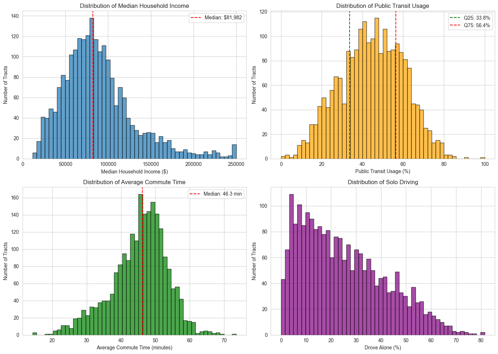
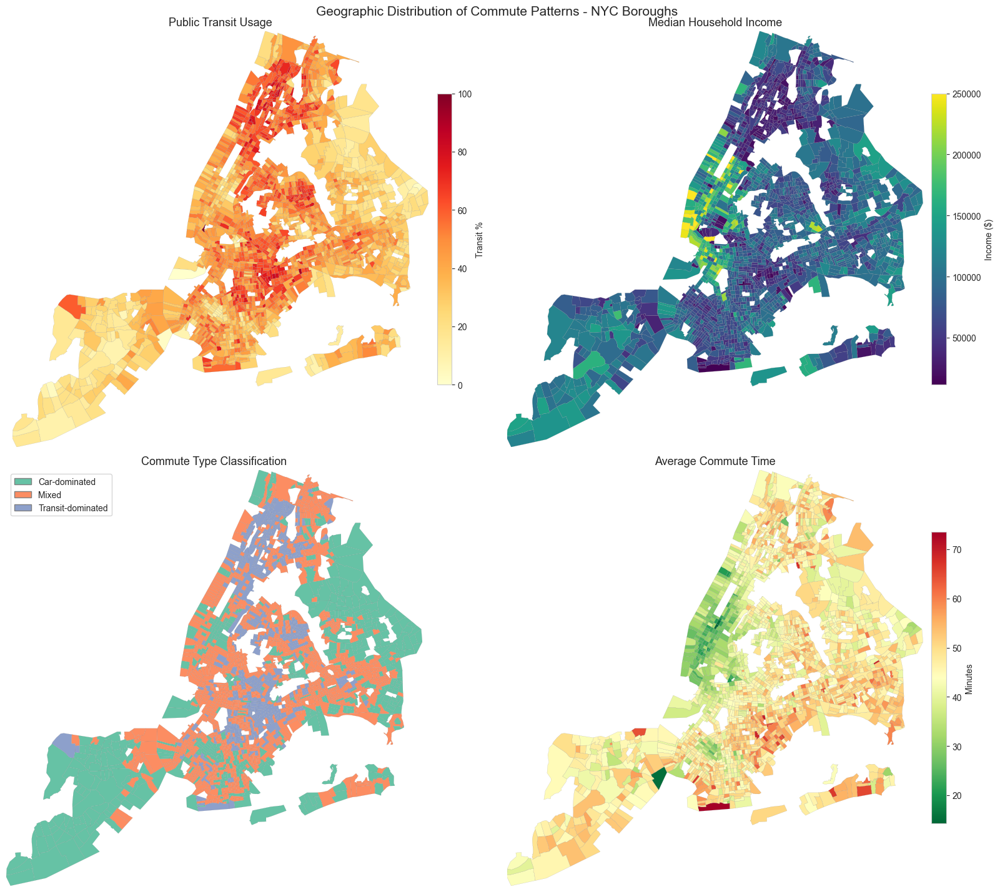
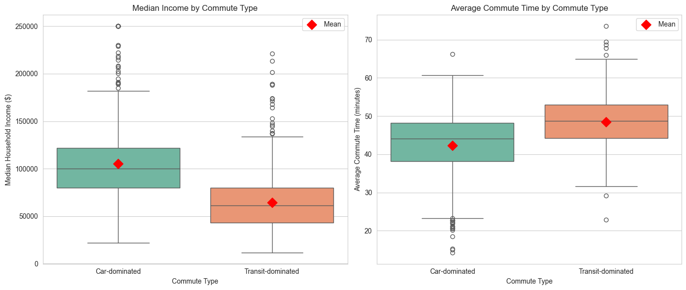
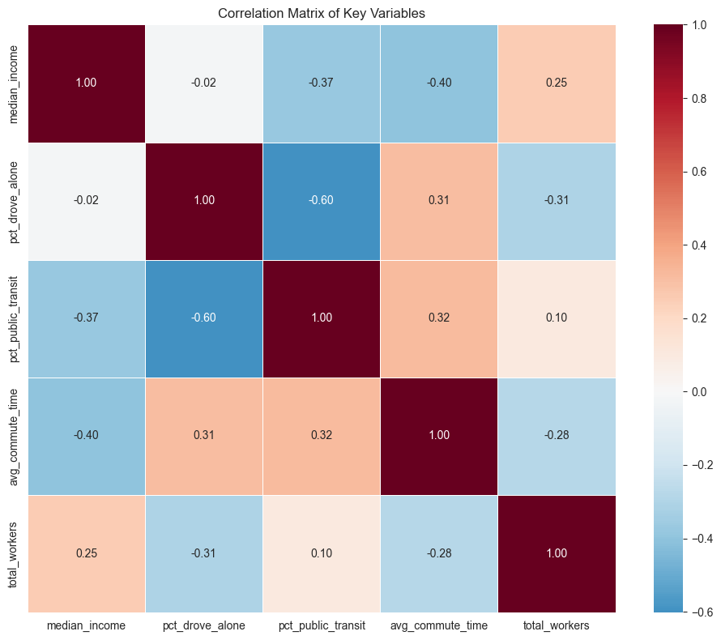
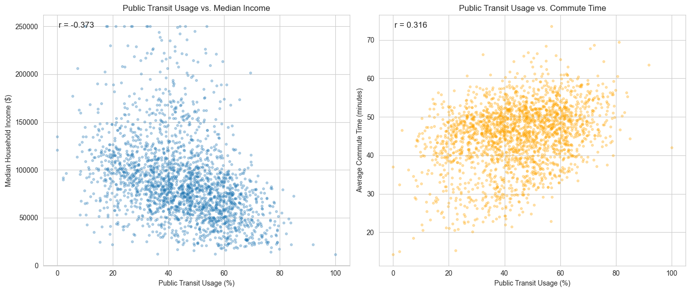
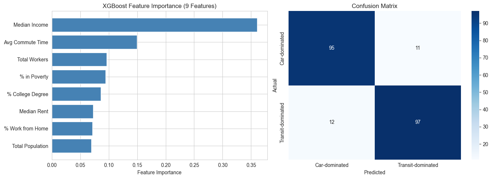

# Commute Mode, Household Income, and Travel Time Analysis
## NYC Census Tracts (ACS 2019-2023)

**IADS Presentation - Introduction to Applied Data Science**

This project analyzes the relationship between commute mode (driving alone vs. public transit), median household income, and average commute time using American Community Survey data from NHGIS.

## Research Questions

1. Is there a significant difference in median household income between census tracts dominated by solo-driving commuters versus tracts dominated by public transit commuters?
2. Is there a significant difference in average commute time between tracts with high public transit usage and tracts with high private vehicle usage?

## Key Findings

| Hypothesis | Test | Result | Effect Size | Practical Significance |
|------------|------|--------|-------------|----------------------|
| H1: Income differs by commute mode | Mann-Whitney U | Reject H₀ (p < 0.001) | r = 0.63 (large) | $38K median difference |
| H2: Commute time differs by transit use | Welch's t-test | Reject H₀ (p < 0.001) | d = 0.80 (large) | 6 min difference |

## Visualizations

### Distribution of Key Variables


### Geographic Distribution - NYC Choropleth Maps


### Income and Commute Time by Commute Type


### Correlation Matrix


### Transit Usage vs Income and Commute Time


### Machine Learning: XGBoost Feature Importance


**Model Accuracy: 87%** - Top predictors: % Receiving SNAP (25.7%), Median Income (22.6%), Avg Commute Time (12.0%)

## Methodology

1. **Data**: 2023 ACS 5-Year Data (2019-2023) from NHGIS, NYC boroughs only (2,192 census tracts)
2. **Classification**: Quartile-based (bottom 25% = car-dominated, top 25% = transit-dominated)
3. **Statistical Tests**: 
   - Mann-Whitney U (income - skewed data)
   - Welch's t-test (commute time - symmetric data)
4. **Machine Learning**: XGBoost classification with 9 features

## Setup

```bash
python -m venv venv
source venv/bin/activate
pip install -r requirements.txt
jupyter notebook analysis.ipynb
```

## Data Citation

> Jonathan Schroeder, David Van Riper, Steven Manson, Katherine Knowles, Tracy Kugler, Finn Roberts, and Steven Ruggles. IPUMS National Historical Geographic Information System: Version 20.0 [dataset]. Minneapolis, MN: IPUMS. 2025. http://doi.org/10.18128/D050.V20.0
